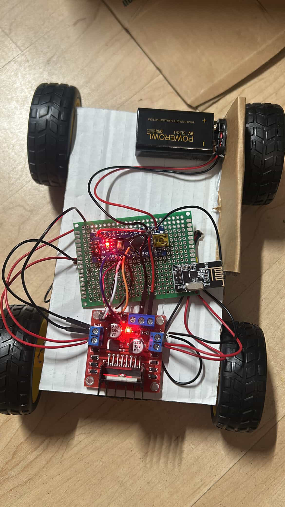
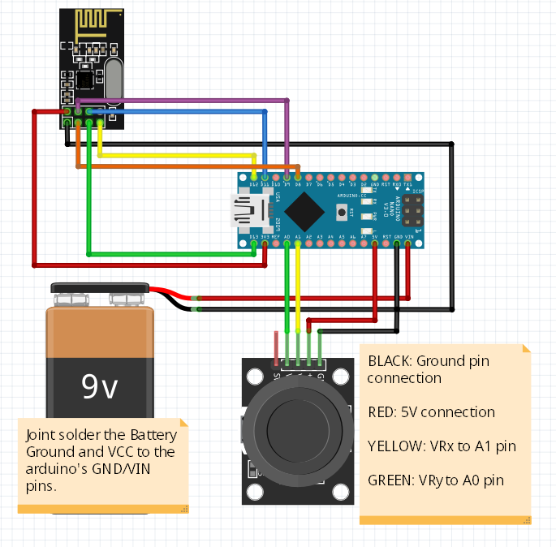

# Wireless RC Car 🚗
An Arduino-based RC car controlled by a custom wireless joystick transmitter. The car receives real-time joystick input over a 2.4GHz radio link and translates it into motor commands — supporting forward, backward, left/right turns, and smooth diagonal movement.
Built as a personal hardware project and demoed at high school.

---

## 📸 Demo

<!-- Upload your photos to the repo and replace the filenames below -->




---

## 🔧 How It Works

The project is split into two Arduinos:

- **Transmitter** (joystick controller): Reads X and Y axis values from the joystick module and sends them wirelessly as a data packet via the nRF24L01 radio module.
- **Receiver** (the car): Listens for incoming data packets and maps the joystick values to motor speed and direction commands sent to the L298N motor driver, which drives two DC motors.

The joystick's analog output (0–1023) is mapped to 8 movement zones: forward, backward, turn left, turn right, and four diagonal glide directions. A center deadzone prevents motor jitter when the joystick is at rest.

---

## 🛒 Components

| Component | Quantity | Purpose |
|---|---|---|
| Arduino Nano | 2 | Microcontroller for transmitter and receiver |
| nRF24L01 Wireless Module | 2 | 2.4GHz radio communication between the two Arduinos |
| Joystick Module | 1 | Reads X/Y position input from the user |
| L298N Motor Driver | 1 | Controls speed and direction of the DC motors |
| DC Motors | 2 | Drives the wheels of the car |
| RC Car Chassis | 1 | Frame, wheels, and battery holder |
| Jumper Wires | — | Connecting components |
| Power Supply | 1 | Battery pack to power the car |

---

## 🔌 Wiring Notes

### Receiver (Car) — Arduino Nano → L298N Motor Driver
| Arduino Pin | L298N Pin |
|---|---|
| D3 (PWM) | ENA — Motor A speed |
| D2 | IN1 — Motor A direction |
| D4 | IN2 — Motor A direction |
| D5 | IN3 — Motor B direction |
| D7 | IN4 — Motor B direction |
| D6 (PWM) | ENB — Motor B speed |

### Both Arduinos → nRF24L01
| Arduino Pin | nRF24L01 Pin |
|---|---|
| D8 | CE |
| D9 | CSN |
| D11 (MOSI) | MOSI |
| D12 (MISO) | MISO |
| D13 (SCK) | SCK |
| 3.3V | VCC ⚠️ Must use 3.3V, not 5V |
| GND | GND |

### Transmitter (Controller) — Joystick Module → Arduino Nano
| Arduino Pin | Joystick Pin |
|---|---|
| A0 | Y-axis |
| A1 | X-axis |
| 5V | VCC |
| GND | GND |

> ⚠️ The nRF24L01 module must be powered with **3.3V**, not 5V — connecting it to 5V will damage the module.

---

## 💻 Code

The project contains five sketches — two for the final RC car and three standalone component tests used during development:

### Final Sketches

| Folder | Sketch | Description |
|---|---|---|
| `receiver/` | `rc_car_receiver.ino` | Upload to the Arduino on the car |
| `transmitter/` | `rc_car_transmitter.ino` | Upload to the Arduino in the joystick controller |

### Installing the RF24 Library
Before uploading either sketch, install the RF24 library in the Arduino IDE:
1. Open Arduino IDE → **Sketch** → **Include Library** → **Manage Libraries**
2. Search for `RF24` by TMRh20
3. Click **Install**

### Uploading
1. Open the sketch for whichever Arduino you are programming
2. Select the correct board: **Tools** → **Board** → **Arduino Nano**
3. Select the correct port: **Tools** → **Port**
4. Click **Upload**
5. Repeat for the second Arduino with the other sketch

### Calibration
The receiver sketch uses threshold values defined at the top of the file to determine the joystick's deadzone and movement boundaries. If your car behaves unexpectedly, run `JoystickMod_Test.ino` first to read your joystick's actual center and min/max values, then update the `#define` constants in `rc_car_receiver.ino` accordingly.

---

## 🧪 Component Tests

These three sketches were written during development to verify each hardware component worked correctly in isolation before integrating everything together. If you are building this project yourself, it is recommended to run these tests first before uploading the final receiver/transmitter code.

### 1. `DCMotor_Test.ino`
Tests the L298N motor driver and DC motors independently of any radio or joystick input.

**What it does:** Runs both motors forward at full speed for 2 seconds, stops them for 1 second, then runs them backward for 2 seconds — then repeats. No serial output; you verify it's working by watching the motors physically spin.

**Use this to confirm:**
- The L298N is wired correctly to the Arduino
- Both motors spin in the correct direction
- PWM speed control is working via the enable pins (ENA/ENB)

---

### 2. `JoystickMod_Test.ino`
Tests the joystick module and prints live X/Y axis readings to the Serial Monitor.

**What it does:** Reads analog values from the joystick's X-axis (A1) and Y-axis (A0) every 300ms and prints them in a labeled table. The column headers reprint every 20 rows to keep the output readable as it scrolls.

**Use this to confirm:**
- The joystick is wired correctly and returning values
- The center resting position reads approximately 512 on both axes
- The full range sweeps from ~0 to ~1023 when moved in each direction
- Use the readings here to set the `#define` calibration values in `rc_car_receiver.ino`

**Expected Serial Monitor output:**
```
          X axis       Y axis
          512          510
          508          514
          0            512       ← joystick pushed left
          1023         512       ← joystick pushed right
```

---

### 3. `nRF_Test.ino`
Tests the nRF24L01 radio module and verifies it initializes correctly on the Arduino.

**What it does:** Initializes the radio module in listening mode and prints its full configuration details to the Serial Monitor via `radio.printDetails()`. The `loop()` is intentionally empty — this sketch is purely for verifying the radio is detected and configured correctly.

**Use this to confirm:**
- The nRF24L01 is wired correctly and recognized by the Arduino
- The SPI connection is working
- The correct data rate, power level, and address are being set
- If `radio.printDetails()` shows all zeros or garbage, there is a wiring issue (most commonly VCC connected to 5V instead of 3.3V)

---

*Built by Arden Zeng — ECE @ Princeton University*
